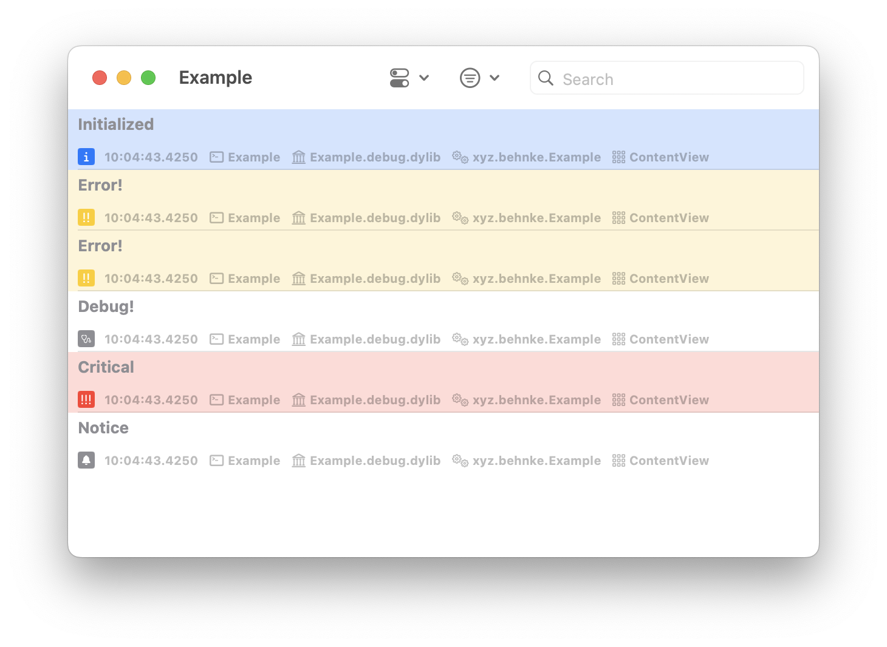
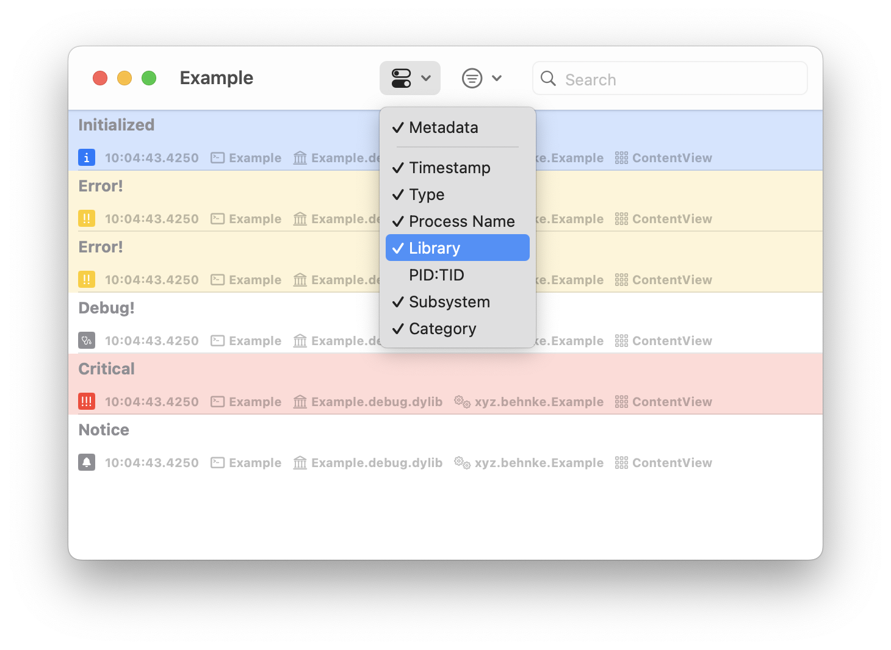
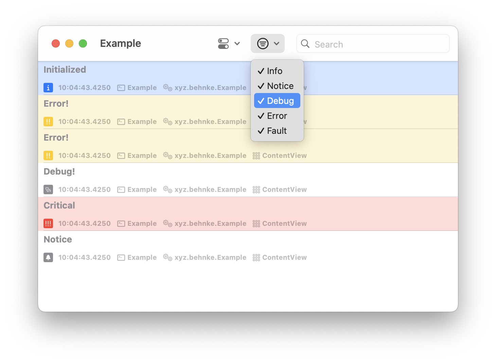
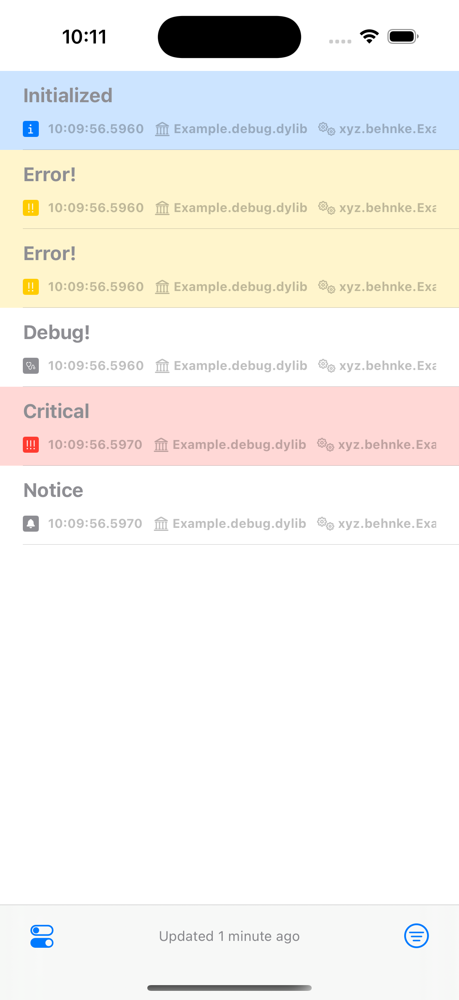
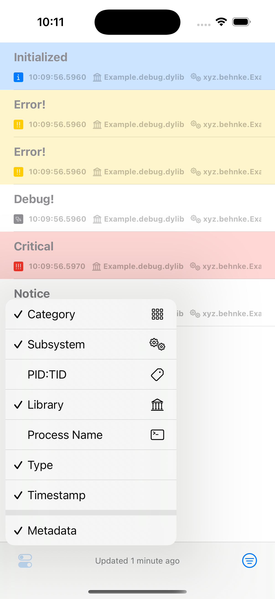
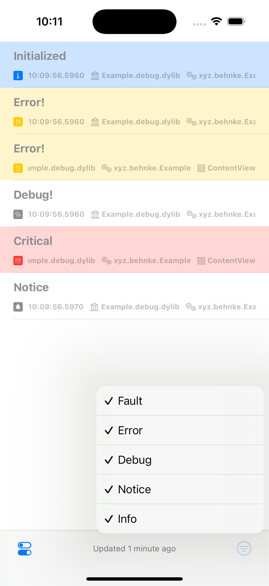

# Flannel

Flannel is a Swift package currently in development, designed to let you view OSLog entries directly within your app, providing an experience similar to Xcode’s native console.

## Installation

### Swift Package Manager

To integrate using Apple's [Swift Package Manager](https://swift.org/package-manager/), add the following as a dependency to your `Package.swift`:

```swift
dependencies: [
    .package(url: "https://github.com/JohnBehnke/Flannel.git", from: "0.1.0")
]
```

## Example

Check out the example application to see WhatsNewKit in action. Simply open the `Example/Example.xcodeproj` and run the "Example" scheme. iOS and macOS are curently supported.

## Usage

Flannel provides a LogView component. To monitor logs emitted from your app’s main bundle identifier, you can simply initialize it with `LogView()`. If you need to track logs from multiple subsystems, you can initialize it with `LogView(subsystems: ['com.example.foo', 'com.example.bar'])`.

## Screenshots

### macOS





### iOS





